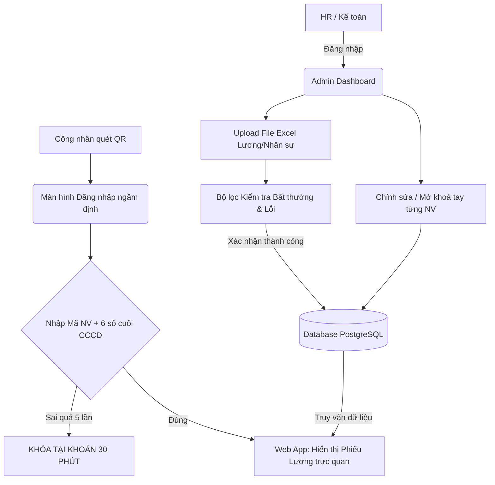

# Tài Liệu Giải Pháp Kiến Trúc: Hệ Thống Tra Cứu Lương Bằng QR Code

> [!IMPORTANT]
> Tài liệu này mô tả chi tiết phương án kiến trúc, luồng vận hành và lộ trình triển khai cho Hệ thống Tra cứu Lương (Quy mô: 10.000 công nhân). Tập trung vào trải nghiệm tối giản (Mobile-first) và bảo mật nghiêm ngặt chống rò rỉ dữ liệu tài chính.

## 1. Ngữ Cảnh Sử Dụng (Context)

### 1.1. Bài toán hiện tại
Nhà máy quy mô 10.000 lao động phổ thông (đa số ít tiếp xúc với các công nghệ phức tạp). Việc phát phiếu lương giấy bằng tay tốn kém thời gian, chi phí trên giấy in và dễ gây lộ thông tin nếu rơi rớt. Việc triển khai các hệ thống dùng mật khẩu (password) truyền thống sẽ thất bại do công nhân dễ quên mật khẩu, kéo theo khối lượng công việc khổng lồ cho phòng HR.

### 1.2. Giải pháp vận hành tại hiện trường
- Dán **1 MÃ QR DUY NHẤT** (kích thước lớn) tại khu vực chung (Nhà ăn, Bảng tin, Xưởng).
- Công nhân dùng điện thoại (Zalo/Camera) quét mã QR.
- Tự nhập **Mã Nhân Viên** và **6 Số Cuối CCCD/CMND** để xem phiếu lương mà không cần đăng ký tài khoản hay nhớ mật khẩu.

---

## 2. Cấu Trúc Phần Mềm Đề Xuất (Architecture)

Hệ thống được thiết kế theo mô hình Client-Server chia làm 2 phân hệ rõ rệt.

### 2.1. Phân hệ Tra Cứu (Dành cho Công nhân)
*   **Giao diện (Frontend):** Ứng dụng Web Mobile-first (Next.js/React). Tối giản 100%. Nền sáng, phông chữ lớn, chỉ gồm Màn hình Đăng nhập và Màn hình Tờ Phiếu Lương. Tốc độ tải trang phản hồi cực nhanh (SSR).

### 2.2. Phân hệ Quản trị & Nhập liệu (Dành cho Admin / HR / Kế Toán)

Với quy mô 10.000 nhân sự, việc nhập tay từng người là bất khả thi. Phân hệ Admin cần tập trung vào việc **Xử lý hàng loạt (Bulk actions)** và **Toàn vẹn dữ liệu**. 

Giao diện Admin Dashboard (được bảo vệ bằng tài khoản đăng nhập bảo mật của Nhân sự) sẽ bao gồm 2 nghiệp vụ lõi:

**A. Quy Trình Upload File Lương Hàng Tháng (Bulk Import)**
Quy trình này đảm bảo tốc độ và giảm thiểu tuyệt đối rủi ro sai sót "thừa/thiếu số 0".
1.  **Bước 1 - Upload File:** HR xuất hệ thống tính lương hiện tại ra dạng file `.xlsx` hoặc `.csv` chuẩn. Kéo thả file chuẩn vào hệ thống web.
2.  **Bước 2 - Khử Lỗi (Validation Stage - Tự động):** Hệ thống không lưu ngay vào DB. Tại bước này, Server sẽ quét nhanh toàn bộ 10.000 dòng để bóc tách sơ bộ:
    *   *Scan rác:* Báo lỗi màu đỏ nếu có ô điền nhầm chữ cái vào cột tính tiền.
    *   *Scan trùng lặp:* Cảnh báo nếu trong file có 2 dòng trùng 1 Mã NV.
    *   *Cảnh báo bất thường:* Highlight vàng nếu thấy 1 lương NV tăng giảm quá đà (VD: dư 1 số 0 khiến lương thành 100 triệu).
3.  **Bước 3 - Preview & Commit:** Màn hình hiển thị "Thông báo: Bạn đang chuẩn bị đưa lên hệ thống dữ liệu lương Tháng 4/2026. Tổng công nhân: `9.980 người`. Tổng quỹ lương gốc: `xxxx VND`". Kế toán bấm "Xác Nhận & Cập nhật". Dữ liệu chỉ chính thức vào máy chủ lúc này.

**B. Quản lý Chỉnh Sửa Điều Chỉnh (Manual Edit)**
Hệ thống cung cấp màn hình **Chỉnh sửa lẻ** cho từng cá nhân. Tính năng này vô cùng hữu dụng khi bị lệch dữ liệu của 1-2 người. 
* Thay vì phải xóa File cũ, sửa file Excel rồi Upload lại cả 10.000 người, Kế toán chỉ cần: Gõ Mã NV -> Bấm Nút CHỈNH SỬA -> Sửa con số -> Lưu lại. Quá trình chỉ mất 10 giây.

**C. Quản lý Tài Khoản Công nhân**
Hỗ trợ tìm kiếm theo Mã NV để xem trạng thái: Tài khoản có đang bị khóa (do nhập sai 5 lần) không? HR có 1 nút **"Mở khóa ngay"** nếu công nhân xuống tận phòng nhân sự nhờ hỗ trợ vì rủi ro bấm nhầm quá nhiều.

---

## 3. Hệ Thống Backend & Database

*   **Backend API:** Node.js (Express/NestJS) tích hợp các thư viện xử lý file Excel dạng Stream (tránh bị tràn Ram văng Server khi đọc file 10.000 dòng).
*   **Cơ sở dữ liệu:** PostgreSQL (Relational DB) để kết nối rành mạch giữa Cột "Nhân sự" và nhiều Cột "Tháng Lương" theo thời gian.

### Sơ đồ Luồng Cập nhật & Tra cứu (Data Flow)

---

## 4. Giải Pháp Bảo Mật Cốt Lõi

> [!CAUTION]
> Dữ liệu lương là tuyệt mật. Mọi tương tác của Admin (tạo, xóa, mở khóa tài khoản) và toàn bộ việc xác thực của công nhân phải đáp ứng các tiêu chuẩn bảo vệ tốt nhất.

1.  **Hash 6 số cuối CCCD:** Không lưu 6 số cuối dạng text thường. Bắt buộc băm mật mã (Hash) từ lúc upload danh sách nhân sự lên DB.
2.  **Chống Brute-Force (Quét mò):** Công nhân này không thể mò của người khác vì Server kích hoạt chế độ "Treol/Khóa" sau 5 lần nhập sai dãy ID.
3.  **Audit Logs trên Admin:** Nếu 1 tài khoản Kế toán bấm "Chỉnh sửa tay", Server phải lưu lại lịch sử `Sửa bởi ai / Lúc mấy giờ / Từ x thành y` phục vụ nghiệp vụ đối soát nội bộ sau này.

---

## 5. Lộ Trình Phương Án Triển Khai (Dự Kiến 6-8 Tuần)

> [!TIP]
> Việc xây dựng ứng dụng theo Phase giúp đưa sản phẩm vào sử dụng rất sớm (trong vòng 2-3 tuần), thu thập feedback từ công nhân và thay đổi UI trước khi hoàn thiện bộ máy quy mô lớn.

### Phase 1: Xây Dựng Core (MVP - Ra mắt sớm)
- [ ] Xây dựng Database PostgreSQL.
- [ ] Làm Admin Portal: Cho phép cấu hình HR Upload file Excel nhân sự chuẩn + File Excel Lương tháng. Ghi nhận `Audit Log`.
- [ ] Phân hệ xác thực an toàn: Mã NV + 6 số CCCD, chặn nhầm 5 lần.
- [ ] Frontend Worker Portal siêu nhẹ: Hiển thị 1 tháng lương hiện hành.

### Phase 2: Hoàn thiện Dashboard Admin và Dữ liệu
- [ ] Cập nhật Frontend công nhân: Cho phép chọn tháng xem lịch sử lương cũ.
- [ ] Dashboard Admin: Trực quan hóa số lượng công nhân đã "xem" phiếu lương, thông báo danh sách những ai chưa xem để đốc thúc.
- [ ] Tính năng cấp lại/Mở khóa cho Admin HR qua 1 click.

### Phase 3: Mở rộng Tích hợp 
- Đồng bộ/bắn API với phần mềm Máy chấm công của nhà máy.
- Gửi tin nhắn qua Zalo báo có lương nếu nhà máy tham gia đăng ký tích hợp Zalo ZNS.
